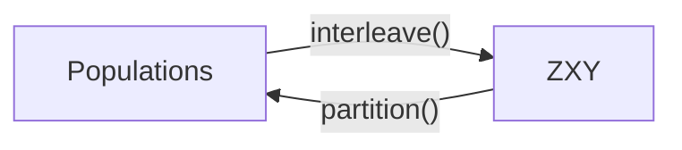

<!-- markdownlint-disable no-inline-html -->
# Data Model

Deconvolve holds a set of events in one of two forms, both defined in `deconvolve.coretypes`. `Populations` groups the events by origin (simulation, data and, where it exists, the particle-level truth of the data) and is used wherever the analysis must distinguish them: when a dataset is constructed, and when results are evaluated. `ZXY` stores all events as a single labelled sample, which is the form required for shuffling, splitting and training.

---

## `Populations`

A `Populations` has three fields:

| Field | Type | Contents |
| :--- | :--- | :--- |
| `mc` | `Events` | The simulation: particle-level events `mc.z` (\(z_\text{gen}\)) and their detector-level counterparts `mc.x` (\(x_\text{sim}\)), paired row by row. |
| `data` | array | The detector-level measurement, \(x_\text{data}\). |
| `truth` | array | The particle-level events underlying the data, \(z_\text{true}\). |

All four arrays are float32 and two-dimensional, with one row per event and one column per observable, even when there is only one observable. The particle-level arrays (`mc.z`, `truth`) must have the same number of columns, as must the detector-level ones (`mc.x`, `data`), and the arrays within each population must have the same number of rows. Constructing a `Populations` that violates any of these raises a `ValueError`. This catches a data source that has not converted its output to float32 at the point where it builds its events, rather than later inside training.

### Isolation of the truth

In a real measurement, \(z_\text{true}\) does not exist, and no part of the method may depend on it. The type is structured to make accidental access difficult:

- `truth` is a separate field, not part of `mc`. A function that receives the simulation, `mc`, has no route to the truth.
- When no truth is available, `truth` is filled with a sentinel value, `TRUTH_SENTINEL` \(= -2^{15}\).
- `has_truth` reports whether real truth is present. Code that needs the truth, such as the particle-level metrics, obtains it through `require_truth()`, which raises an error when only the sentinel is present.

---

## `ZXY`

A `ZXY` stores data and simulation together, one row per event:

| Field | Contents |
| :--- | :--- |
| `z` | Particle-level features: \(z_\text{gen}\) for simulated events, and the `truth` field for data events. |
| `x` | Detector-level features: \(x_\text{sim}\) or \(x_\text{data}\). |
| `y` | The label: \(y = 1\) for data, \(y = 0\) for simulation. |

In this form the events can be shuffled and divided into training, validation and test splits without regard to their origin.

### Conversion between the two forms

`Populations.interleave()` concatenates the data events (\(y = 1\)) followed by the simulated events (\(y = 0\)). `ZXY.partition()` separates the events by label into a `Populations` again.

A `Populations` converted to `ZXY` and back is recovered exactly. The reverse does not hold: `partition()` does not preserve the order of a shuffled `ZXY`, so a `ZXY` should not be expected to survive a round trip through `Populations`.

### Training form

Before training, the splits of a `ZXY` are transferred once to the accelerator as JAX arrays (`deconvolve.data.device`). All batches are drawn from these on the device, so no further transfers between host and device take place during a run.

---

## Why the sentinel is finite

In training, the generator is evaluated on the `z` column of every row, including the data rows. The data rows' outputs are then discarded by the weight normalization,

\[w_i = y_i + (1 - y_i)\, \hat{g}(z_i),\]

where \(\hat{g}\) is the generator's output normalized over the simulated events. Each data row receives weight exactly 1, and its \(z\) contributes nothing to the weights, the loss or the gradients.

This relies on the discarded values being finite. In IEEE 754 arithmetic, \(0 \times c = 0\) for any finite \(c\), but \(0 \times \text{NaN} = \text{NaN}\). A NaN sentinel would therefore propagate through the normalization sum to every weight in the batch, and from there to every gradient. \(-2^{15}\) is finite, lies far outside the range of any standardized feature, and is exactly representable in every IEEE binary format down to half precision, so `has_truth` can test for it by exact comparison.

`deconvolve leakage-check` verifies the masking end to end (see [System Design](system-design.md#the-truth-is-isolated-by-type)).
