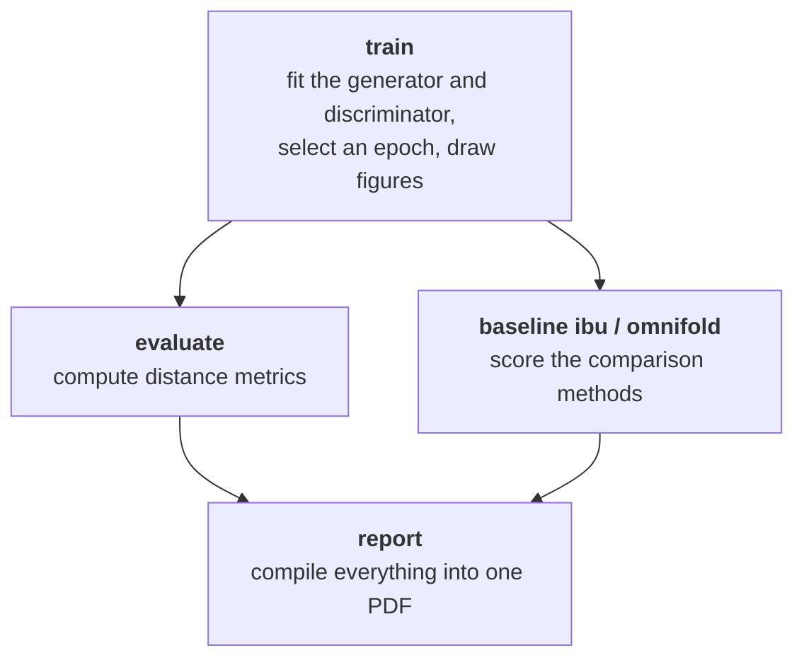
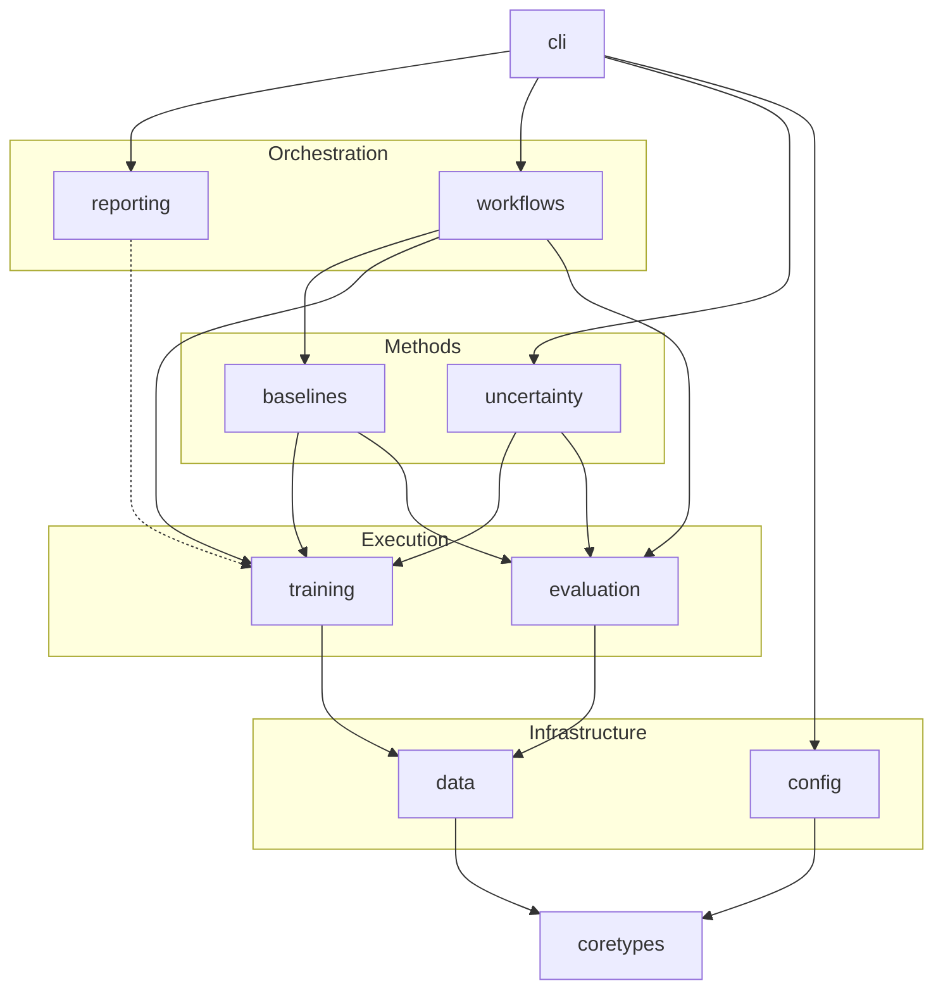

<!-- markdownlint-disable no-inline-html -->
# System Design

This page describes how <span style="font-variant: small-caps;">Deconvolve</span> is organised: the stages of an analysis, the package that implements each one, how the packages depend on each other, and the design decisions that shape the code as a whole. It is intended for readers who want to extend the package or understand its behaviour beyond the command line.

---

## Stages of an analysis

An analysis is a sequence of commands operating on one run directory (see [Reporting & Artifacts](../user-guide/reporting.md)). Each command reads what earlier commands wrote there and adds its own output, so any stage can be re-run on its own.



`train` runs `evaluate` itself as its final step. The variance studies (`uncertainty freeze`, `run` and `collect`) are a separate workflow built from the same components; see [Uncertainty Quantification](uncertainty.md).

---

## Package layout

```text
src/deconvolve/
├── cli.py              command-line interface
├── config/             configuration files: discovery, validation, `config show`
├── coretypes/          event containers, run configuration, constants, enums
├── data/               Gaussian and jet datasets, download and caching, device transfer
├── training/           network architectures, the training loop, MMD model selection
├── evaluation/         distance metrics and figures
├── baselines/          Iterative Bayesian Unfolding and OmniFold
├── uncertainty/        bootstrap × seed variance designs
├── reporting/          the PDF report
├── workflows/          end-to-end `train` and `leakage-check` pipelines
└── instrumentation/    logging and phase timing
```

| Package | Responsibility |
| :--- | :--- |
| `coretypes` | The types every other package shares: event containers that keep simulation and truth apart, the record of a run's configuration, physical constants and the observable catalogue. |
| `config` | The layered configuration described in [Configuration](../user-guide/configuration.md). Depends only on the standard library and `coretypes`. |
| `data` | Produces a run's events and its train, validation and test splits, reproducibly from `data_seed`. Downloads and caches the jet dataset, and moves splits onto the accelerator once per run. |
| `training` | The generator and discriminator, the training loop, and the [MMD model selection](../theory/mmd.md). |
| `evaluation` | The [distance metrics](../user-guide/evaluation.md) and the per-observable figures. |
| `baselines` | [IBU and OmniFold](../user-guide/baselines.md), scored with the same splits and the same metrics as <span style="font-variant: small-caps;">Deconvolve</span>. |
| `uncertainty` | Variance designs that separate the effect of the dataset from that of the initialization. |
| `reporting` | Fills a LaTeX template from a run directory and compiles it. |
| `workflows` | Composes `data`, `training`, `evaluation` and `baselines` into the `train` and `leakage-check` commands. |
| `instrumentation` | Logging, and the optional phase timing enabled by `DECONVOLVE_TIMING`. |

---

## Dependencies between packages

Dependencies point in one direction. Nothing depends on `cli` or `workflows`, and no two packages depend on each other. Every package may use `coretypes` and `instrumentation`; those edges are omitted below for clarity.



The dashed edge is an import deferred to the one function that needs it, which keeps `reporting` free of JAX at import time. `coretypes` imports nothing from the rest of the package at run time.

---

## Design decisions

### The truth is isolated by type

No network may ever see \(z_\text{true}\), the particle-level truth of the data: in a real measurement it does not exist. This is enforced by the event containers in `coretypes`, not by convention. A population holds simulation (\(z_\text{gen}\), \(x_\text{sim}\)) and data (\(x_\text{data}\)) separately from the truth, so code given the simulation cannot reach \(z_\text{true}\). Code that needs the truth, namely the particle-level metrics and diagnostics, must request it explicitly, and that request fails for a dataset with no truth.

`deconvolve leakage-check` tests this end to end on a small Gaussian problem. Run it once with `--clean` and once with `--poison`, which replaces every \(z_\text{true}\) value with a sentinel far outside the data. Both runs use the same seeds, so if \(z_\text{true}\) cannot reach a network, their detector-level results agree.

### One compiled program per training run

The adversarial game does not fit Keras's standard `fit` loop, so training is implemented directly in JAX. The entire run (every epoch, every discriminator and generator step, and the validation passes) is compiled as a single XLA program. Data are transferred to the accelerator once, and the program returns the parameters of every epoch.

Decisions about model quality are made afterwards, on the host. The [MMD selection](../theory/mmd.md) scores every epoch's weights and restores the best. Because the selection criterion is evaluated outside the compiled program, it can use quantities (such as a particle-level diagnostic) that must never enter training.

### Keras on JAX, in single precision

Importing `deconvolve` sets Keras's backend to JAX and disables 64-bit JAX arrays, unless the environment already specifies otherwise. Events and networks are float32. Where float32 accumulation would visibly affect a reported number, the computation is arranged to avoid it: the Wasserstein distance accumulates a signed difference rather than two cumulative distributions, and the histogram divergences are evaluated in float64 on the host.

### OmniFold runs in a separate process

OmniFold requires TensorFlow as its Keras backend, while <span style="font-variant: small-caps;">Deconvolve</span> requires JAX, and Keras supports only one backend per process. OmniFold therefore runs in a separate Python 3.13 environment, provisioned automatically by `uv`, and exchanges data with the main process through files. See [Baselines](../user-guide/baselines.md).

### Reproducibility

Two seeds control a run. `data_seed` determines the dataset, its splits, the order of training batches and the MMD subsamples, so runs that differ only in hyperparameters see identical events in an identical order. `seed` determines only the networks' initialization, and is chosen at random if not given. Both are recorded in `config.json`, together with where every setting came from.

A run is reproducible to within the non-determinism of the accelerator: on GPUs, some reductions accumulate in an order that varies between executions, which can change results in the last digits.
