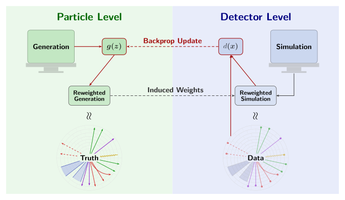

<!-- markdownlint-disable-file no-inline-html list-marker-space -->
# Deconvolve

**Deconvolve** learns continuous, unbinned per-event weights that correct simulated (Monte Carlo) distributions to match observed detector data, through an adversarial learning algorithm between a truth-level generator and a reco-level discriminator.

It is built on [Keras 3](https://keras.io) with the [JAX](https://docs.jax.dev/) backend, with single-precision floating-point arithmetic pipeline and JIT-compiled training loop.

---

## Introduction

Cross-section measurements from particle physics experiments are recorded as reco-level quantities, smeared by finite resolution and distorted by acceptance and efficiency. However, in order to compared them against theory predictions and across experiments, they must be corrected to the particle-level.

Unfolding is the process of recovering particle-level distributions from the detector-level ones. In some form, every unfolding method involves inverting a response kernel (or response matrix for binned data) built from simulation. Traditional unfolding methods bin the data in a small number of kinematic variables and invert (or regularize and invert, as in Iterative Bayesian Unfolding or SVD unfolding). That machinery does not extend to the multi-differential regime. Every additional observable multiplies the number of bins, response matrices become ill-conditioned or singular, and hand-tuned regularization stops being tractable well before number of jet substructure variables a modern analysis might seek to unfold jointly.

[OmniFold](https://arxiv.org/abs/1911.09107) unfolds without binning by replacing the response matrix with classifiers that estimate likelihood ratios directly from unbinned events, alternating between particle level and detector level until the reweighting converges. Deconvolve instead poses the whole problem as a single adversarial learning algorithm: a generator learns a continuous particle-level weight function in one pass, with a discriminator at detector level supplying the training signal, rather than iterating several pairs of independently-refit classifiers to a fixed point.

<figure class="ran-figure" markdown="span">
  { .ran-schematic }
  <figcaption>
    The generator <code>g(z)</code> assigns a weight to each particle-level
    event; those weights are carried to detector level, where the
    discriminator <code>d(x)</code> compares reweighted simulation against
    observed data and backpropagates through the weights.
  </figcaption>
</figure>

Concretely, two networks are trained through an adversarial objective:

1. **Generator $g(z)$**: Predicts a continuous per-event weight from Generation (particle-level MC) features $z_{\text Gen.}$, parameterized by a neural network:

    $$
    w_i = \frac{g(z_i)}{\frac{1}{N}\sum_{j=1}^N g(z_j)}
    $$

2. **Discriminator $d(x)$**: Evaluates detector-level (reconstructed) features $x$, learning to distinguish Data (detector-level measurement, $y = 1$) from reweighted Simulation (detector-level MC, $y = 0$).

At convergence, the discriminator cannot distinguish reweighted simulation from real data ($d(x) \to 0.5$, loss $\to \ln 2$), and the generator's weights yield an optimal, unbinned multi-differential correction.

---

## Features

- **JAX backend**: the training loop is a fused `lax.scan` program, JIT-compiled with on-device metric evaluation.
- **Single-precision floating-point arithmetic pipeline**: fixed precision throughout, with no silent downcasting, for reproducible numerics.
- **MMD-based checkpoint selection**: unbiased Maximum Mean Discrepancy with multi-scale Gaussian kernels, evaluated on held-out validation splits.
- **Baselines**: Iterative Bayesian Unfolding and OmniFold for direct comparisons.

---

## Navigation

-   **[Getting Started](getting-started/installation.md)**

    ---

    Installation instructions, optional GPU setup, and a quickstart guide.  

-   **[User Guide](user-guide/cli.md)**

    ---

    The `deconvolve` CLI: `train`, `evaluate`, `report`; commands to evaluate the baselines.

-   **[Theory & Methodology](theory/reweighting.md)**

    ---

    The adversarial learning algorithm, Maximum Mean Discrepancy-based model selection, and empirical convergence diagnostics.

-   **[API Reference](api/index.md)**

    ---

    Python API for `deconvolve.training`, `deconvolve.data`, `deconvolve.evaluation`, `deconvolve.uncertainty` and other package commands.

