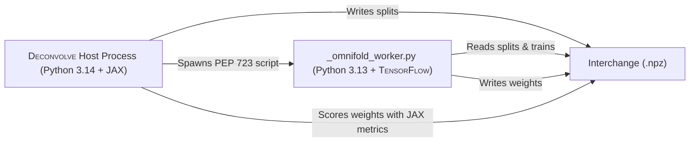

<!-- markdownlint-disable no-inline-html -->
# Comparison Baselines

<span style="font-variant: small-caps;">Deconvolve</span> includes built-in implementations of Iterative Bayesian Unfolding (IBU) and <span style="font-variant: small-caps;">OmniFold</span>, two standard unfolding methods in HEP.

---

## Shared Evaluation Protocol

To ensure a fair scientific comparison, baselines in `deconvolve.baselines._shared` adhere to a strict evaluation protocol:

1. **Identical Datasets**: Baselines load byte-for-byte identical event populations (`fit` and `test` splits) generated for a <span style="font-variant: small-caps;">Deconvolve</span> run.
2. **Train/Val Only for Fitting**: Baselines fit their response models exclusively on `Split.TRAIN | Split.VAL`.
3. **Identical Held-out Evaluation**: The test split is evaluated using the exact same vectorized metrics (`deconvolve.evaluation.evaluate`).

---

## 1. Iterative Bayesian Unfolding (IBU)

Iterative Bayesian Unfolding (also known as D'Agostini unfolding) is a classic binned unfolding method based on Bayes' theorem.

### Implementation Details

- **Module**: `deconvolve.baselines.ibu`
- **Binning**: Computes purity-based bins per observable.
- **Weights**: Converts unfolded bin probabilities back into per-event weights for evaluation.

### Running IBU

```shell
deconvolve baseline ibu runs/2026-09-19T164500Z
```

---

## 2. <span style="font-variant: small-caps;">OmniFold</span>

<span style="font-variant: small-caps;">OmniFold</span> is an unbinned machine learning unfolding algorithm that iteratively trains pairs of neural network classifiers using full phase-space event information. The particular implmentation relevant to this comparison is <span style="font-variant: small-caps;">MultiFold</span>, which unfolds a specific, pre-selected set of multiple high-level observables.

### The Isolated Worker Architecture

<span style="font-variant: small-caps;">OmniFold</span> depends on <span style="font-variant: small-caps;">TensorFlow</span>, which cannot coexist in <span style="font-variant: small-caps;">Deconvolve</span>'s primary Python runtime because:

- <span style="font-variant: small-caps;">TensorFlow</span> has no official wheels for Python > 3.13 at the time of writing, but the project supports all python versions >= 3.12.
- <span style="font-variant: small-caps;">TensorFlow</span> cannot share a Keras backend with JAX within a single process.

To resolve this, <span style="font-variant: small-caps;">Deconvolve</span> uses an [_isolated worker pattern_](https://packaging.python.org/en/latest/specifications/inline-script-metadata/#inline-script-metadata) established under the [PEP 723](https://peps.python.org/pep-0723/) standard to run <span style="font-variant: small-caps;">OmniFold</span>.



1. **Host (`deconvolve/baselines/omnifold.py`)**: Prepares populations from `config.json`, serializes them to a temporary `.npz` file, and invokes the worker.
2. **Worker (`deconvolve/baselines/_omnifold_worker.py`)**: A standalone PEP 723 script executed via `uv run --isolated --python 3.13` with pinned <span style="font-variant: small-caps;">TensorFlow</span> dependencies.
3. **Scoring**: The worker writes the resulting event weights back to the `.npz` file, and the host evaluates them using <span style="font-variant: small-caps;">Deconvolve</span>'s JAX metric pipeline.

### Running <span style="font-variant: small-caps;">OmniFold</span>

```shell
deconvolve baseline omnifold runs/2026-09-19T164500Z
```
